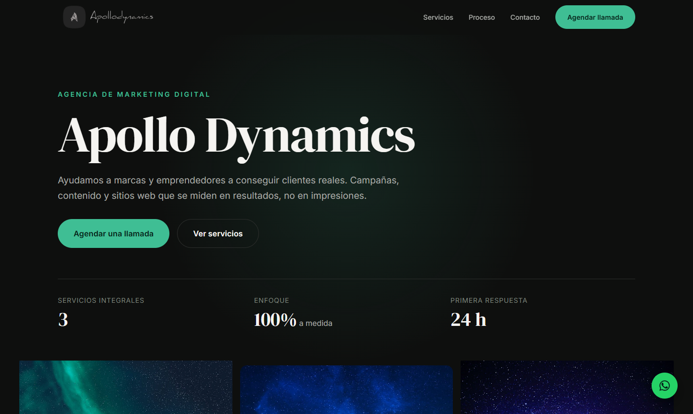

# Apollo Dynamics

Sitio web de una agencia de marketing digital, escrito desde cero en HTML, CSS y JavaScript puro.
Sin frameworks, sin build step y sin dependencias en tiempo de ejecución.



**Demo:** https://curious-pony-6cb829.netlify.app

---

## Por qué existe

La agencia tenía su sitio en Webflow. Funcionaba, pero traía los problemas típicos de un
constructor visual: ~2.700 líneas de CSS del framework, jQuery, scripts de Meta Pixel y
reCAPTCHA, e imágenes de hasta 5157 px sin optimizar. Además el contenido mezclaba inglés
y español, y no había menú móvil real.

Este proyecto lo reemplaza conservando la identidad visual (paleta oscura, verde de marca,
tipografía serif) pero con código propio, mantenible y sin terceros.

## Stack

| | |
|---|---|
| Markup | HTML5 semántico |
| Estilos | CSS moderno: custom properties, Grid, Flexbox, `clamp()` |
| Interacción | JavaScript vanilla (ES5-compatible, sin transpilación) |
| Tipografías | DM Serif Display + Inter (Google Fonts) |
| Formulario | FormSubmit (sin backend propio) |
| Hosting | Netlify |

Cero dependencias. No hay `package.json` porque no hace falta.

## Qué tiene

- **One-page** con navegación por anclas: hero, galería, servicios, proceso, contacto.
- **Menú móvil accesible**: cierra con `Escape`, bloquea el scroll de fondo, `aria-expanded` correcto.
- **Reveal en scroll** con `IntersectionObserver` y parallax sutil en la galería.
- **Formulario validado** en cliente, con errores inline, región `aria-live` y honeypot antispam.
- **Botón flotante de WhatsApp** con mensaje prellenado.
- **Responsive** desde 360 px, verificado sin scroll horizontal.
- **SEO**: Open Graph, Twitter Card y JSON-LD `ProfessionalService`.

## Decisiones de diseño

Algunas cosas se hicieron distinto del original, a propósito:

**Tarjetas de servicio alternadas.** En el original las tres tarjetas estaban del mismo lado,
lo que generaba una columna monótona. Acá alternan izquierda/derecha con `:nth-of-type(even)`.

**Máscara degradada en la galería.** El original cortaba las fotos en seco contra el fondo.
Acá se funden con `mask-image: linear-gradient(...)`.

**Sección de proceso, nueva.** El sitio original mostraba estética pero no método. Cuatro pasos
—diagnóstico, estrategia, ejecución, medición— comunican cómo trabaja la agencia.

**Contenido unificado en español.** El original mezclaba "Our Services" con "Ver Proyecto".

**Honeypot en lugar de reCAPTCHA.** Un campo oculto que los bots completan y las personas no.
Evita cargar 200 KB de JavaScript de Google y no molesta al visitante.

## Accesibilidad

- Navegación completa por teclado, con foco visible y skip-link.
- Contraste verificado: el texto oscuro sobre las tarjetas de color cumple WCAG AA.
- `prefers-reduced-motion` respetado — sin animaciones ni parallax si el sistema lo pide.
- Imágenes con `width`/`height` explícitos para evitar saltos de layout (CLS).

## Estructura

```
index.html              Página completa
css/styles.css          Estilos en 15 secciones numeradas
js/main.js              Nav móvil, reveal, parallax, formulario
assets/brand/           Logo y favicon
assets/hero/            Fotos de la galería
assets/servicios/       Ilustraciones de las tarjetas
```

## Correrlo localmente

No necesita instalación:

```bash
python -m http.server 8899
```

Abrir http://127.0.0.1:8899

> El formulario **no funciona en local**. FormSubmit solo acepta envíos desde un dominio
> público; desde `localhost` responde con error. El sitio lo detecta y lo avisa en pantalla
> en vez de mostrar un error genérico.

## Deploy

Cualquier hosting estático sirve. Actualmente en Netlify.

- **Netlify Drop** — arrastrar la carpeta a [app.netlify.com/drop](https://app.netlify.com/drop).
- **Deploy continuo** — conectando este repo, cada `git push` republica el sitio.

## Activar el formulario

Usa [FormSubmit](https://formsubmit.co): gratis, sin registro ni tarjeta.
El endpoint está en `js/main.js` (constante `ENDPOINT`).

1. Con el sitio ya publicado, enviar una consulta de prueba.
2. Llega un mail de FormSubmit pidiendo confirmar la casilla. Aceptarlo.
3. Desde ahí, las consultas llegan por mail.

Para ocultar el email del código fuente, FormSubmit da un alias aleatorio tras el primer
envío; se reemplaza en `ENDPOINT`.

**Alternativa:** al estar en Netlify, se puede usar Netlify Forms — sin terceros, sin paso
de confirmación y con las consultas visibles en el panel.

## Pendiente

- [ ] Dominio propio (falta actualizar `<link rel="canonical">` y las metas `og:`/`twitter:`)
- [ ] Confirmar la casilla en FormSubmit
- [ ] Reemplazar las métricas del hero por datos reales de la agencia

## Créditos

Fotografías de [Pixabay](https://pixabay.com) y [Pexels](https://pexels.com).
Ilustraciones de servicios de stock. Logotipo propiedad de Apollo Dynamics.

## Licencia

Código bajo [MIT](LICENSE). Los activos de marca están excluidos — ver la nota en el archivo.
